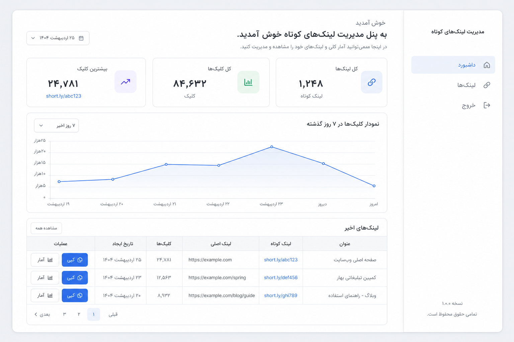
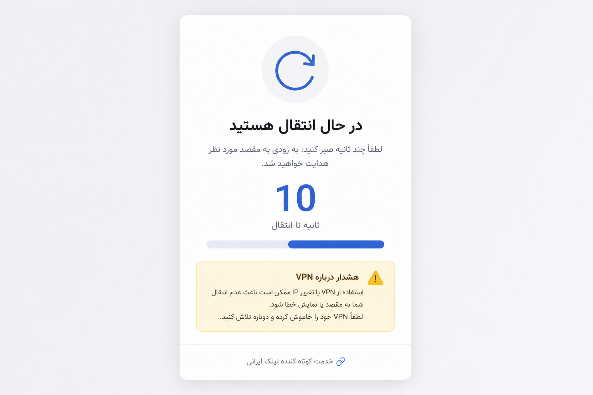

# Shortlink Manager

A lightweight, self-hosted URL shortener built with plain PHP. No Composer, no build step, no cron jobs — deploy on any cPanel host and start creating short links in minutes.

Features a polished RTL admin panel, per-link analytics, and a configurable redirect interstitial with countdown and VPN notice.

<p align="center">
  
</p>

---

## Highlights

| | |
|---|---|
| **Zero dependencies** | Pure PHP 7.4+ — upload and run |
| **Dual database** | SQLite (zero config) or MySQL (cPanel-ready) |
| **Beautiful UI** | shadcn-inspired design, RTL Persian interface, Vazirmatn font |
| **Analytics** | Dashboard charts + per-link daily/hourly click stats |
| **Smart redirects** | 10-second interstitial with VPN notice before destination |
| **Flexible hosting** | Root domain, subdomain, or subdirectory (`/go`) |

---

## Screenshots

### Admin dashboard

Track total links, clicks, and performance over the last 7 days.

<p align="center">
  
</p>

### Redirect interstitial

Visitors see a countdown and VPN notice before being sent to the destination URL.

<p align="center">
  
</p>

---

## Requirements

- PHP **7.4+**
- PDO extension (`pdo_sqlite` and/or `pdo_mysql`)
- Apache `mod_rewrite` (enabled by default on cPanel)

---

## Quick start (local)

```bash
git clone https://github.com/aliesm-com/shortlink-manager.git
cd shortlink-manager
cp app/config.example.php app/config.php
php -S localhost:8000 -t public
```

Open [http://localhost:8000/admin/login](http://localhost:8000/admin/login)

**Default password:** `password` — change this before going live.

---

## URL structure

| URL | Description |
|-----|-------------|
| `/` | Redirects to `home_url` from config (or admin login if empty) |
| `/admin/login` | Admin login |
| `/admin/dashboard` | Dashboard with stats |
| `/admin/links` | Create and manage links |
| `/admin/links/{id}/stats` | Per-link analytics |
| `/{slug}` | Public short link → redirect interstitial |

---

## Configuration

Copy the example config and edit `app/config.php`:

```bash
cp app/config.example.php app/config.php
```

| Key | Description |
|-----|-------------|
| `base_url` | Full site URL without trailing slash (auto-detected if empty) |
| `base_path` | Subdirectory name, e.g. `go` for `example.com/go` |
| `home_url` | Homepage redirect URL (empty = admin login) |
| `assets_prefix` | Custom asset path prefix (see subdirectory notes) |
| `db_driver` | `sqlite` (default) or `mysql` |
| `db_path` | SQLite file path |
| `db_host` | MySQL host (usually `localhost` on cPanel) |
| `db_port` | MySQL port (default: `3306`) |
| `db_name` | MySQL database name |
| `db_user` | MySQL username |
| `db_pass` | MySQL password |
| `db_charset` | MySQL charset (default: `utf8mb4`) |
| `admin_password_hash` | Bcrypt hash for admin password |
| `ip_salt` | Salt for hashing visitor IPs |
| `redirect_delay` | Countdown seconds before redirect (default: `10`) |
| `login_max_attempts` | Failed logins before lockout |
| `login_lockout_seconds` | Lockout duration in seconds |

### Generate a password hash

```bash
php -r "echo password_hash('your-secure-password', PASSWORD_DEFAULT);"
```

Paste the output into `admin_password_hash`.

### SQLite (default)

```php
'db_driver' => 'sqlite',
'db_path'   => __DIR__ . '/../storage/database.sqlite',
```

Tables are created automatically. Ensure `storage/` is writable:

```bash
chmod 755 storage
```

### MySQL (cPanel)

Create a database and user in **cPanel → MySQL Databases**, then:

```php
'db_driver' => 'mysql',
'db_host'   => 'localhost',
'db_port'   => 3306,
'db_name'   => 'cpanel_user_shortlink',
'db_user'   => 'cpanel_user_shortlink',
'db_pass'   => 'your-database-password',
'db_charset'=> 'utf8mb4',
```

Tables are created on first request — no manual import needed.

---

## Deployment on cPanel

### Option A — Subdomain (recommended)

Best for a dedicated short-link domain like `links.example.com`.

1. Upload the project to your account (e.g. `/home/username/shortlink/`)
2. In **cPanel → Domains → Subdomains**, create `links.example.com`
3. Set **Document Root** to the `public/` folder:
   ```
   /home/username/shortlink/public
   ```
4. Copy and edit config (see above)
5. Visit `https://links.example.com/admin/login`

No `base_path` needed.

### Option B — Subdirectory (e.g. `example.com/go`)

1. Upload the full project to `public_html/go/` (`app/`, `public/`, `storage/`, `.htaccess`)
2. Uncomment `RewriteBase` in both `.htaccess` files:
   ```apache
   RewriteBase /go/
   ```
3. Set in `app/config.php`:
   ```php
   'base_url'  => 'https://example.com/go',
   'base_path' => 'go',
   ```
4. On nginx-backed hosts, static assets are served from `/go/public/assets/` — the app handles this automatically when `base_path` is set.

### Option C — Addon domain

Same as Option A — point Document Root to `public/`.

### Checklist

| Step | Action |
|------|--------|
| 1 | Upload files via File Manager or FTP |
| 2 | `cp app/config.example.php app/config.php` |
| 3 | Set admin password hash and `ip_salt` |
| 4 | Choose SQLite or MySQL |
| 5 | `chmod 755 storage` (SQLite only) |
| 6 | PHP 7.4+ with PDO extensions enabled |
| 7 | Test `/admin/login`, create a link, open `/{slug}` |

No Cron, Composer, or npm required.

---

## Project structure

```
shortlink-manager/
├── app/
│   ├── Controllers/      # Request handlers
│   ├── Models/           # Link & Click models
│   ├── Services/         # Database, links, stats
│   ├── Views/            # PHP templates (RTL UI)
│   └── config.php        # Your settings (gitignored)
├── public/
│   ├── index.php         # Front controller
│   ├── assets/           # CSS & JS
│   └── .htaccess
├── storage/              # SQLite database (gitignored)
└── docs/screenshots/     # README images
```

---

## Troubleshooting

| Problem | Solution |
|---------|----------|
| **404 on all pages** | Enable `mod_rewrite`; ensure `.htaccess` is allowed (`AllowOverride All`) |
| **CSS/JS not loading** | Set `base_url` and `base_path` for subdirectory installs; on nginx hosts assets use `/public/assets/` automatically |
| **SQLite error** | Make sure `storage/` exists and is writable |
| **MySQL error** | Verify credentials; host is usually `localhost` on cPanel; grant user ALL PRIVILEGES on the database |
| **Wrong short URLs** | Set `base_url` to the full URL including path, e.g. `https://example.com/go` |

---

## Security

- Never commit `app/config.php` (listed in `.gitignore`)
- Use a strong admin password
- Change `ip_salt` in production
- Keep `app/` and `storage/` outside the web root when possible (Document Root = `public/`)

---

## License

MIT
